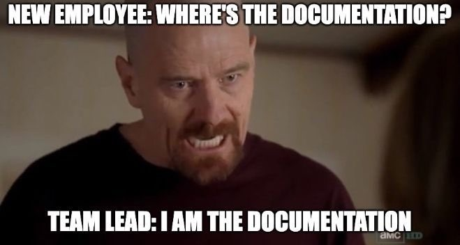

# OpenBiomechanics Project (OBP)

The OpenBiomechanics Project is a public research dataset from [Driveline Baseball Research & Development](https://drivelinebaseball.com/mission-and-purpose/). It provides cleaned C3D motion-capture files, processed full-signal time series, point-of-interest (POI) metrics, and high-performance assessments for baseball pitching and hitting.

Project homepage: [openbiomechanics.org](https://openbiomechanics.org)



> [!IMPORTANT]
> Large data files are distributed through [GitHub Releases](https://github.com/drivelineresearch/openbiomechanics/releases), not Git. Existing clones created before the July 2026 history rewrite must be re-cloned. See the [changelog](CHANGELOG.md#2026-07-04--repository-overhaul-and-history-rewrite).

## Start here

| Goal | Start with | Extra download? |
| --- | --- | --- |
| Explore pitch or swing summary metrics | [`examples/01_explore_poi.py`](examples/01_explore_poi.py) and the [`obp` loader](obp/README.md) | No |
| Explore force-plate assessment metrics | [`examples/04_hp_assessment.py`](examples/04_hp_assessment.py) | No |
| Compare hitting swings in a browser | [`swing_visualizer/`](swing_visualizer/README.md) | Yes, hitting C3Ds |
| Read raw marker trajectories | [`examples/02_read_c3d.py`](examples/02_read_c3d.py) | Yes, discipline C3Ds |
| Join processed time-series tables | [`examples/03_join_fullsig.py`](examples/03_join_fullsig.py) | Yes, full-signal archives |
| Understand variables and conventions | The relevant [module documentation](#modules) and [data dictionaries](#data-dictionaries-and-datasheet) | No |
| Work with computer vision or calibration | [`computer_vision/`](computer_vision/README.md) | Some tutorials need media |
| Contribute a fix or example | [`CONTRIBUTING.md`](CONTRIBUTING.md) | No |

## Dataset snapshot

| Module | Records | Population / scope | In Git |
| --- | ---: | --- | --- |
| Pitching | 411 fastball trials | 100 athletes | POI + metadata |
| Hitting | 677 swing trials | 98 athletes; 604 paired HitTrax rows | POI + metadata + HitTrax |
| High Performance | 1,934 assessments | 1,162 athletes | Complete assessment table |

Most participants are collegiate-level. Pitching is fastball-only. See [`DATASHEET.md`](DATASHEET.md) for exact composition, collection, missingness, intended uses, and limitations.

## Quickstart

The public loader and examples are tested on Python 3.10 and 3.12. Clone the repository, create an isolated environment, and install the minimum analysis dependencies:

```bash
git clone https://github.com/drivelineresearch/openbiomechanics.git
cd openbiomechanics
python3 -m venv .venv
source .venv/bin/activate
python3 -m pip install --upgrade pip
python3 -m pip install -r requirements.txt
```

On Windows, activate with `.venv\Scripts\activate` and use Git Bash or WSL for the download script.

The small `obp` helper is repository-local; run Python or Jupyter from the repository root:

```python
import obp

pitching_poi = obp.load_poi("pitching")
hitting_metadata = obp.load_metadata("hitting")
hittrax = obp.load_hittrax()
high_performance = obp.load_hp()

print(pitching_poi.shape)
print(pitching_poi[["pitch_speed_mph", "elbow_varus_moment"]].describe())
```

Then run an example that uses only the in-repository CSVs:

```bash
python3 examples/01_explore_poi.py
python3 examples/04_hp_assessment.py
```

Figures are created automatically under the ignored `examples/figures/` directory.

## Getting the large data

The full pitching + hitting release is about 1.1 GB compressed. The downloader requires the [GitHub CLI](https://cli.github.com/), `unzip`, Bash, and either `sha256sum` or `shasum`. Authenticate the CLI once with `gh auth login`, or provide `GH_TOKEN` in automation; `gh auth status` confirms the active account. The downloader defaults to the canonical OBP repository and verifies every asset against [`scripts/release_checksums.sha256`](scripts/release_checksums.sha256) before extracting or placing it. Maintainers can use the documented staging-repository override in [`RELEASING.md`](RELEASING.md).

```bash
# Both pitching and hitting (default)
scripts/download_data.sh

# One discipline only
scripts/download_data.sh --discipline pitching
scripts/download_data.sh --discipline hitting

# Add optional media to a selected dataset download
scripts/download_data.sh --discipline pitching --with-media

# Optional assets only (do not download the 1.1 GB dataset)
scripts/download_data.sh --skip-data --with-media
scripts/download_data.sh --skip-data --with-mokka
```

The same discipline selection is available from Python:

```python
import obp

obp.download("pitching")
obp.download(["pitching", "hitting"], media=True)
obp.download(data=False, media=True)  # computer-vision media only
```

The downloader extracts raw C3Ds into each module's `data/c3d/` directory. It leaves processed full-signal tables zipped in `data/full_sig/` so users can extract only what they need:

```bash
cd baseball_pitching/data/full_sig
unzip joint_angles.zip
unzip joint_velos.zip
```

## Modules

| Module | Contents | Documentation |
| --- | --- | --- |
| Baseball Pitching | C3D, full-signal kinematics/kinetics, POI, metadata | [`baseball_pitching/`](baseball_pitching/README.md) |
| Baseball Hitting | C3D, full-signal biomechanics, POI, metadata, HitTrax | [`baseball_hitting/`](baseball_hitting/README.md) |
| High Performance | Force-plate and physical-assessment metrics | [`high_performance/`](high_performance/README.md) |
| Computer Vision | Introductory OpenCV examples and provisional multicamera calibration | [`computer_vision/`](computer_vision/README.md) |
| Additional Resources | ezc3d and archived workshop tutorials; cited references | [`additional_resources/`](additional_resources/README.md) |

## Repository layout

```text
baseball_pitching/       pitching data, model files, and documentation
baseball_hitting/        hitting data, model files, and documentation
high_performance/        assessment data and protocol documentation
computer_vision/         CV tutorials, examples, and calibration work
additional_resources/    tutorials and cited references
obp/                     repository-local pandas/path helper
examples/                runnable public workflows
scripts/                 verified downloads and dictionary generation
tests/                   loader, schema, docs, and repository checks
```

The notebooks under `baseball_*/code/py/` are provenance scripts that require private Driveline database access. They document how the release was produced; they are not standalone public pipelines.

## Data relationships and sampling

- Pitching POI, metadata, and full-signal tables join on `session_pitch`.
- Hitting POI, metadata, HitTrax, and full-signal tables join on `session_swing`.
- Full-signal tables also use `time`. Marker-derived tables are sampled at 360 Hz; force-plate tables at 1,080 Hz. Do not use a naïve exact-time inner join across those rates.
- Multiple trials can belong to the same athlete. Split train/test data by athlete or session when leakage matters.
- High Performance uses `athlete_uid`, while the released pitching/hitting metadata use different identifiers. The public files do not provide a person-level crosswalk between them.

## Runnable examples

| Script | What it demonstrates | Download needed? |
| --- | --- | --- |
| [`01_explore_poi.py`](examples/01_explore_poi.py) | Validated POI/metadata join and descriptive pitch analysis | No |
| [`02_read_c3d.py`](examples/02_read_c3d.py) | C3D marker names, sampling rate, and 3D trajectory | Pitching C3Ds |
| [`03_join_fullsig.py`](examples/03_join_fullsig.py) | One-to-one full-signal join on `session_pitch` + `time` | Pitching full signal |
| [`04_hp_assessment.py`](examples/04_hp_assessment.py) | Assessment-level CMJ distribution and repeated-measures context | No |

See [`examples/README.md`](examples/README.md) for exact commands.

## Data dictionaries and datasheet

- Generated column references live at `<module>/data/data_dictionary.csv`; the combined machine-readable form is [`data_dictionary.json`](data_dictionary.json).
- Pitching and hitting references include descriptions and conventions. The High Performance reference is currently schema-only (names, inferred types, and examples); authoritative per-column definitions remain a documented gap.
- Regenerate them with `python3 scripts/build_data_dictionary.py` or verify freshness with `python3 scripts/build_data_dictionary.py --check`.
- [`DATASHEET.md`](DATASHEET.md) documents motivation, composition, collection, preprocessing, uses, distribution, and maintenance following the *Datasheets for Datasets* framework.

## Citing

If you use OBP, please cite it using [`CITATION.cff`](CITATION.cff). GitHub's “Cite this repository” button reads that file.

## License

OBP is dual-licensed:

- **Code** — MIT License. See [`LICENSE-CODE.md`](LICENSE-CODE.md).
- **Data and biomechanics documentation** — CC BY-NC-SA 4.0 with an additional specific exclusion. See [`LICENSE-DATA.md`](LICENSE-DATA.md) and the OBP site under “Usage Terms.”

The exclusion is load-bearing; read the complete data license before use:

> While the license is clear that this data cannot be used for commercial purposes (which includes but is not limited to for-profit organizations, corporations, and sole proprietorships with the intent to profit now or in the future), there is also one additional specific exclusion where this data cannot be used in any form without a specific written commercial (paid) license: ***Any employee or contractor employed by, associated with, or a significant shareholder of a professional sports organization or financial analysis firm is forbidden to use The OpenBiomechanics Project data for any use whatsoever.***

For research collaboration, commercial licensing, or questions about the larger IRB-approved dataset, see [`CONTRIBUTING.md`](CONTRIBUTING.md).

## IRB information

WCG IRB (formerly Western IRB) provided ethical approval for the data-collection procedures under **Western IRB # WB-DLR-115**.

## Contributing and support

Bug fixes, clearer documentation, reproducible examples, and data-quality reports are welcome. Start with [`CONTRIBUTING.md`](CONTRIBUTING.md), use the pull-request checklist, and report security or sensitive-content issues privately according to [`SECURITY.md`](SECURITY.md).

Release history and notable project changes are recorded in [`CHANGELOG.md`](CHANGELOG.md).
