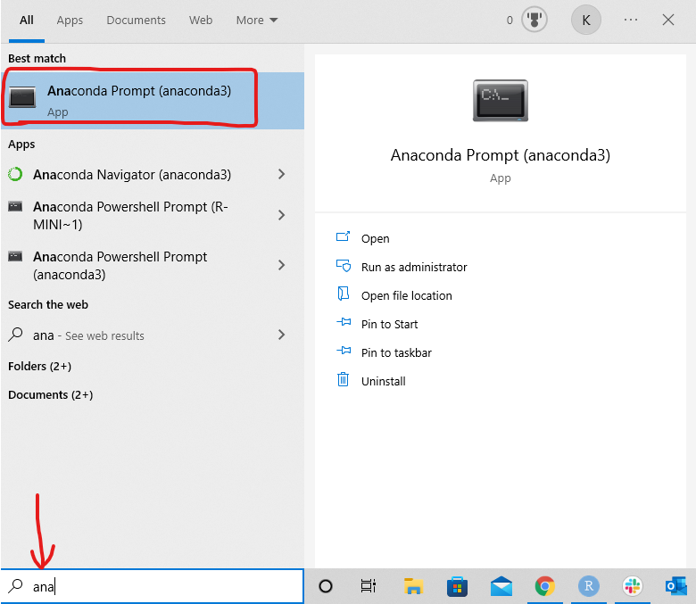
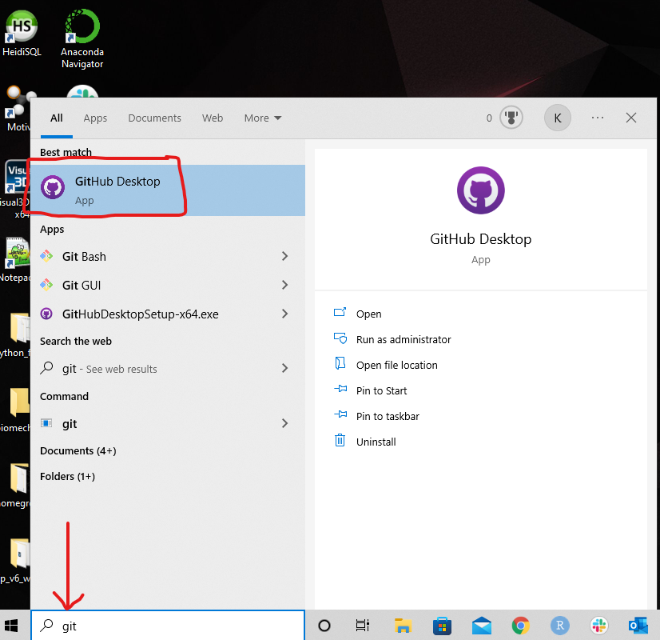
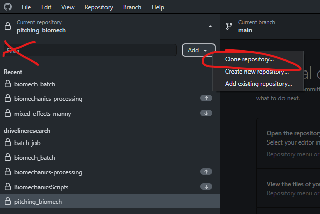
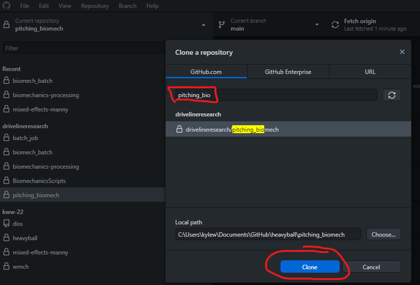
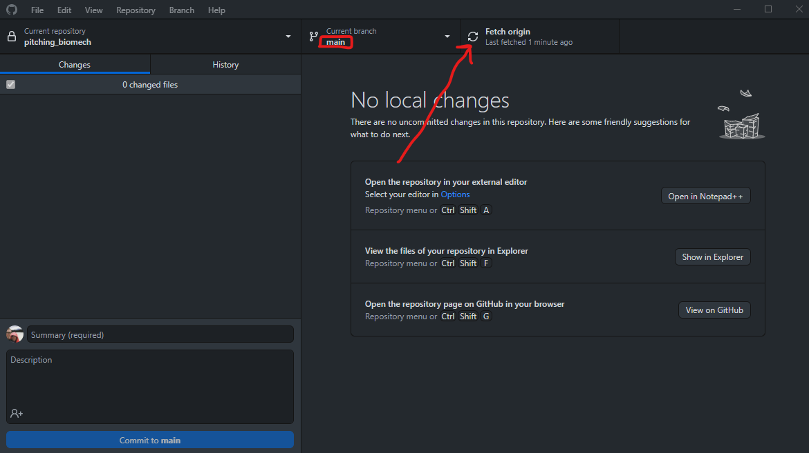
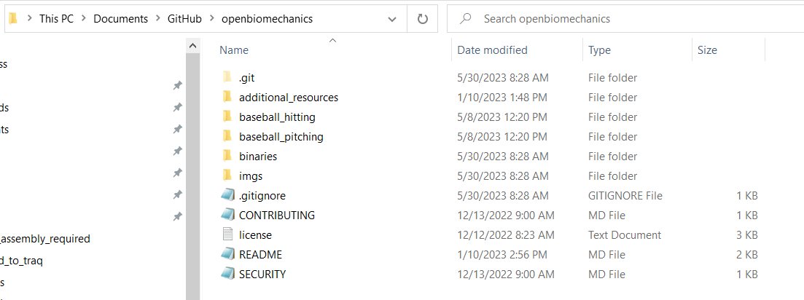

# A Workshop with Biomechanics Industry: Learn to use Python to analyze your biomechanical data

<aside>
🚀 To be ready for the ISBS workshop , you’ll need Python and a Python interactive development environment (IDE). For this workshop, I’m going to use Anaconda + Microsoft VS Code. There are many other ways, including VS code by itself. Since most of the differences between IDEs aren’t too relevant to us beginning and intermediate coders, I encourage you to mess around with different IDEs and find one that you like.

</aside>

## (Optional) Sign up for ChatGPT and GitHub Copilot

- Greatest coding helpers out there
- Greatly improve efficiency and reduce learning curve
- ~~If you happen to~~ ***when*** you get stuck, asking ChatGPT is one of the best things you can do

## Download and Install Anaconda + VS Code

[Create an Anaconda account](https://anaconda.org/)

[Download and install](https://repo.anaconda.com/archive/Anaconda3-2021.11-Windows-x86_64.exe) the Anaconda app

[Download and install](https://code.visualstudio.com/download) Microsoft VS Code

## Create Python Environment & Install Necessary Packages

### Open anaconda Prompt



### Create an “empty “environment

```python
conda env create --name isbs2023 # python=3.8.5
```

- If creating environment within Anaconda, Anaconda will default to installing some of the most popular packages for you.
- This will take a few minutes
- Can also import environment yaml file from GitHub repo tutorial

### Install necessary packages

- `conda activate <ENV NAME>`

```python
conda activate isbs2023
```

- `pip install <PACKAGE NAME>` or `conda install <PACKAGE NAME>`
    - replace `<PACKAGE NAME>` with your desired package
- Popular packages:
    - pandas, numpy
    - if I forgot one, you’ll see the anaconda prompt tell you “no module found”, just repeat the pip install with whatever module(s) it doesn’t find

<aside>
🚀 After setting up your IDE, you’ll need to access the data we will use within Driveline Baseball’s OpenBiomechanics Project Repository. You can do this by signing up for a GitHub account and using GitHub Desktop to access the online repo

</aside>

## Create GitHub Account + Download GitHub Desktop

[Create a GitHub account](https://github.com/signup?ref_cta=Sign+up&ref_loc=header+logged+out&ref_page=%2F&source=header-home)

[Download + install](https://central.github.com/deployments/desktop/desktop/latest/win32) the GitHub Desktop app

- [additional instillation instructions](https://docs.github.com/en/desktop/installing-and-configuring-github-desktop/installing-and-authenticating-to-github-desktop/installing-github-desktop)

## Pull OpenBiomechanics Repository

### Open the GitHub Desktop app



### Clone the repository

Search by URL if necessary:

- [https://github.com/drivelineresearch/openbiomechanics](https://github.com/drivelineresearch/openbiomechanics)

(pics below use a different repo called *pitching_biomech*; just imagine the images are searching for *openbiomechanics* instead)





### Fetch the latest `main` branch commit(s)



**Online repository should now be in your file explorer!**

