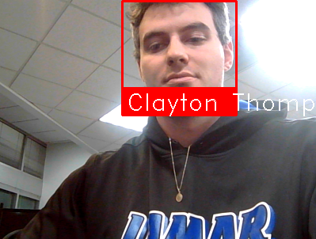

# Starting Out In Computer Vision

Welcome to the comprehensive starting point for anyone new to computer vision (CV). This repository serves as an introductory guide and toolkit for learning and applying CV concepts and techniques. If you're embarking on this journey for the first time, you'll find a set of resources here that will help you understand the basics and build a strong foundation.

## Introduction to Computer Vision

Computer vision is an interdisciplinary field that deals with how computers can gain high-level understanding from digital images or videos. It seeks to automate tasks that the human visual system can do. With the resources provided in this repository, you can start experimenting with image and video analysis, and even real-time processing.

## Key Resources and Libraries

This repository includes references and examples using several widely-used computer vision libraries and frameworks:

- **YOLOv8 / Ultralytics**: Cutting-edge object detection models that are fast and accurate. [Ultralytics GitHub](https://github.com/ultralytics/ultralytics)
- **Kinovea**: A video analysis tool aimed at sports professionals and all users interested in motion. [Kinovea.org](https://www.kinovea.org/)
- **SORT**: A simple online and realtime tracking algorithm for 2D multiple object tracking in video sequences. [SORT GitHub](https://github.com/abewley/sort)
- **torchvision**: A package consisting of popular datasets, model architectures, and common image transformations for computer vision. [torchvision GitHub](https://github.com/pytorch/vision/)
- **OpenCV**: An open-source computer vision and machine learning software library. [OpenCV Python Package](https://pypi.org/project/opencv-python/)
- **Face Recognition**: Perhaps the simplest and best face recognition library for Python and the command line. [Face Recognition GitHub](https://github.com/ageitgey/face_recognition)

## Starting Your First Project

It's often tempting to dive straight into complex projects. However, I recommend familiarizing yourself with the basics of each library using static images and pre-recorded video before tackling larger projects.

### Starting With A Photo

- Begin with a static image to understand how object detection and face recognition work.
- See the example in the script: [face_image.py](hello_world/face_image.py).

### Transition To Video

- Move on to analyzing pre-recorded videos to handle data over time.
- Check out the video processing example: [face_video.py](hello_world/face_video.py).

### Finally, Live Video Feed

- Progress to a live video feed for real-time processing and tracking.
- Live tracking example can be found in: [face_tracking.py](hello_world/face_tracking.py).

### Expected Outputs

As you progress through these exercises, you should expect to produce outputs similar to the following:

*Replace the above link with the actual path to your output example image.*

## Getting Help

If you encounter any issues or have questions:

1. Consult the documentation and resources linked above.
2. Seek guidance from community forums or directly from the tools' official support channels.
3. For more personalized assistance, post your queries to platforms like Stack Overflow, or ask ChatGPT-4 for help with troubleshooting.
4. If you still need help, contact Clayton Thompson. Crafting your first working script can be challenging, but with perseverance, you will succeed.

---

For more information and to ensure you are compliant with the licensing terms, please visit [www.openbiomechanics.org](http://www.openbiomechanics.org). All data and reports are subject to the licensing outlined on the website and the GitHub repository.
