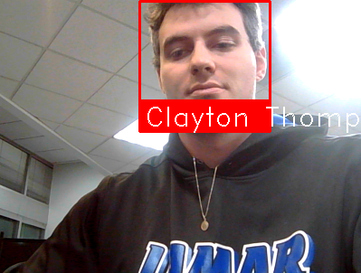

# Starting Out In Computer Vision

Welcome to the comprehensive starting point for anyone new to computer vision (CV). This repository serves as an introductory guide and toolkit for learning and applying CV concepts and techniques. If you're embarking on this journey for the first time, you'll find a set of resources here that will help you understand the basics and build a strong foundation.

## Introduction to Computer Vision

Computer vision is an interdisciplinary field that deals with how computers can gain high-level understanding from digital images or videos. It seeks to automate tasks that the human visual system can do. With the resources provided in this repository, you can start experimenting with image and video analysis, and even real-time processing.

## Key Resources and Libraries

This repository includes references and examples using several widely-used computer vision libraries and frameworks:

- **YOLOv8 / Ultralytics**: Cutting-edge object detection models that are fast and accurate. [Ultralytics GitHub](https://github.com/ultralytics/ultralytics)
- **Kinovea**: A video analysis tool aimed at sports professionals and all users interested in motion. [Kinovea.org](https://www.kinovea.org/)
- **SORT**: A simple online and realtime tracking algorithm for 2D multiple object tracking in video sequences. [SORT GitHub](https://github.com/abewley/sort)
- **torchvision**: A package consisting of popular datasets, model architectures, and common image transformations for computer vision. [torchvision GitHub](https://github.com/pytorch/vision/)
- **OpenCV**: An open-source computer vision and machine learning software library. [OpenCV Python Package](https://pypi.org/project/opencv-python/)
- **Face Recognition**: A Python face recognition library. Note that `ageitgey/face_recognition` is largely unmaintained and depends on `dlib`, which can be difficult to build. For new work, consider [MediaPipe](https://github.com/google-ai-edge/mediapipe) as a modern, actively maintained alternative for pose and face landmarking. [Face Recognition GitHub](https://github.com/ageitgey/face_recognition)

## Starting Your First Project

It's often tempting to dive straight into complex projects. However, I recommend familiarizing yourself with the basics of each library using static images and pre-recorded video before tackling larger projects.

### Starting With A Photo

- Begin with a static image to understand how object detection and face recognition work.
- See the example in the script: [face_image.py](hello_world/face_image.py).
- Run `python3 computer_vision/hello_world/face_image.py --help` for portable input and optional face-crop output arguments.

### Transition To Video

- Move on to analyzing pre-recorded videos to handle data over time.
- Check out the video processing example: [face_video.py](hello_world/face_video.py).
- Pass the input explicitly: `python3 computer_vision/hello_world/face_video.py --video path/to/video.mp4`.

### Finally, Live Video Feed

- Progress to a live video feed for real-time processing and tracking.
- Live tracking example can be found in: [face_tracking.py](hello_world/face_tracking.py).
- Start the default webcam with `python3 computer_vision/hello_world/face_tracking.py --camera 0` and press `q` to quit.

### Expected Outputs

As you progress through these exercises, you should expect to produce outputs similar to the following:

## Demo Videos and Dependencies

The demo videos referenced by these examples now live in the `cv-media-v1` GitHub Release. Run `scripts/download_data.sh --skip-data --with-media` from the repository root to download, verify, and restore only the media. The legacy face examples use the focused [`requirements-face-recognition.txt`](requirements-face-recognition.txt) environment; its `dlib` dependency may require a C++/CMake toolchain. The broader CV examples use [computer_vision/requirements.txt](requirements.txt).

The video scripts use the two tracked sample portraits beside them as references by default. Pass `--training-dir` to use your own `.jpg`/`.jpeg` portraits; filename stems become labels. Shared path-safe loading, face matching, video iteration/writing, and annotation helpers live in [computer_vision/utils.py](utils.py). Optional dependencies load only after argument parsing, so every script's `--help` works in the minimal repository environment.

## Getting Help

If you encounter any issues or have questions:

1. Consult the documentation and resources linked above.
2. Seek guidance from community forums or directly from the tools' official support channels.
3. For more personalized assistance, consult each library's official documentation or post your queries to community forums such as Stack Overflow.
4. For a reproducible correction to this repository, follow the root [`CONTRIBUTING.md`](../CONTRIBUTING.md) guide and propose a focused pull request.

## OBP-CV Calibration

The [`calibration/`](calibration/) directory contains cross-validated provisional
intrinsics, held-out pair diagnostics, an eight-camera OptiTrack pose graph,
timing diagnostics, exact source hashes, reproducible scripts, and explicit
limitations for the OBP-CV calibration recordings. Start with its README before
using any matrix; the current rig is camera-19-relative and has not yet been
aligned to final laboratory coordinates.

Current validated provisional results:

| System | Intrinsics | Relative extrinsics |
| --- | --- | --- |
| OptiTrack 15–22 | Three-fold held-out medians 0.167–0.274 px; full-frame-monotonic models | 8 held-out-qualified edges connect all cameras; independent closure 0.072° / 3.27 mm |
| Edgertronic 1–4 | Held-out medians 0.183–0.204 px after robust view filtering | Checkerboard overlap remains disconnected |
| iPhone | Held-out median 0.146 px; interleaved focal stability 0.017% | Not genlocked; rolling shutter and variable PTS remain |

The next recommended stage is cube and CS-200 annotation followed by held-out
epipolar overlays, undistortion grids, and joint bundle adjustment. The complete
schema and acceptance plan is in
[`calibration/ANNOTATION_PLAN.md`](calibration/ANNOTATION_PLAN.md).

---

For more information and to ensure you are compliant with the licensing terms, visit [openbiomechanics.org](https://openbiomechanics.org). All data and reports are subject to the licensing outlined on the website and in this repository.
