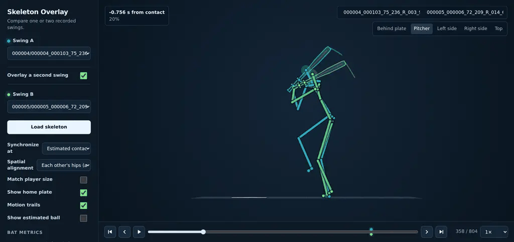
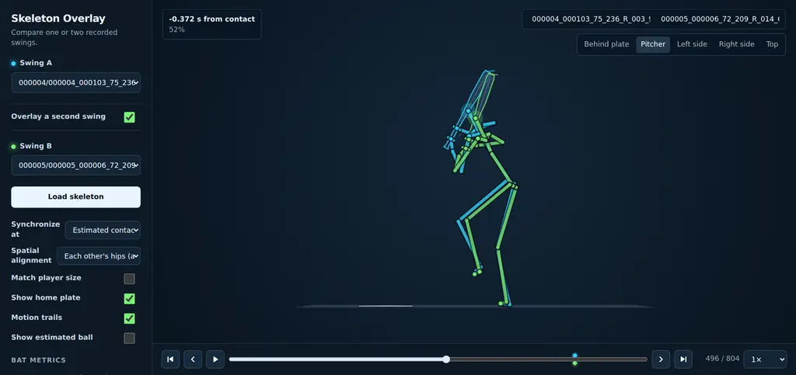
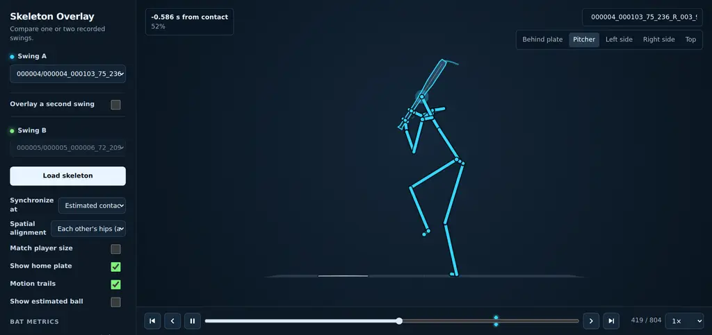

# Hitting swing viewer

Play back a hitting C3D in the browser as an animated 3D skeleton and reconstructed bat, or overlay two recorded swings for mechanical comparison.



## Features

- **Single swing playback & dual overlay**: Inspect an individual swing or overlay two recorded trials simultaneously.
- **Temporal synchronization**: Synchronize playback at estimated contact, swing start, peak bat speed, or recording percentage.
- **Spatial alignment**:
  - **Each other's hips (at sync)**: Aligns pelvis positions horizontally at the synchronized event while maintaining grounded feet.
  - **Each other's hips (stance)**: Aligns initial stance positions.
  - **Home plate**: Displays both batters in their recorded batter's box locations relative to plate.
- **Match player size**: Scales body segments and arm reach to normalize athlete stature so mechanics can be compared without height discrepancies.
- **Bat metrics & comparison**: Calculates peak barrel speed, contact barrel speed, attack angle, bat direction, time to contact, and exit velocity, displaying side-by-side values and differences ($\Delta$).
- **3D camera presets**: Quickly toggle between Pitcher, Behind plate, Left side, Right side, and Top-down views, or orbit freely by dragging.



## Prerequisites

Use Python 3.10 or 3.12 and the [root quickstart](../README.md#quickstart) to create an isolated environment. Then install the repository dependencies and download the hitting C3D files (requires authenticated `gh`, Bash, `unzip`, and a SHA-256 utility):

```bash
python3 -m pip install -r requirements.txt
scripts/download_data.sh --discipline hitting
```

## Run the viewer

From the repository root, run:

```bash
python3 swing_visualizer/app.py
```

The application opens `http://127.0.0.1:8765` in your default browser.

- Pass `--no-open` to start the server without automatically opening a browser window.
- Pass `--port PORT` to use a custom port.
- Pass `--data-root PATH` to load C3Ds from another directory.



## Interpret the results

The viewer derives several values from marker trajectories. They are exploratory estimates, not recorded laboratory measurements:

- **Contact** is estimated as the valid frame with the highest reconstructed barrel speed using a central difference over adjacent frames. Frames with a missing bat pose at the current or either adjacent frame are excluded. This is not a measured impact event or an independently validated contact detector.
- **Bat geometry** is fitted to the available rigid-body bat markers and rendered at standard proportions.
- **Ball path** is an exploratory illustration rendered with a fixed launch trajectory.
- **Exit velocity** is parsed from trial filenames ending in tenths of a mile per hour (e.g. `_954.c3d` = 95.4 mph).


- **Size matching** applies a uniform height ratio to the second swing's displayed geometry, including its bat and illustrated ball. It does not fit individual segment lengths. Speed, angle, and timing metrics retain their original, unscaled values.
- **Input conventions:** the released hitting C3Ds use meters, 360 Hz markers, and the documented [hitting lab axes](../baseball_hitting/README.md). The viewer expects that marker set, unit system, and filename convention; `--data-root` selects another copy of those files, not an arbitrary C3D format.
- **Missing measurements:** no valid bat trajectory means no contact/peak event. There is no interpolation across marker gaps. The filename-derived exit velocity is separate from the exploratory marker-derived values.

## Validation and contributions

Run `python3 -m unittest discover -s tests -v` for the public loader and viewer regressions. The optional real-C3D test reports a skip when its release fixture is absent. Browser smoke coverage and exact commands are in [`tests/browser/README.md`](../tests/browser/README.md).

The viewer is an optional exploratory tool contributed by [Truman Daniels](https://github.com/trumandaniels). It does not replace the published biomechanics processing pipeline. Code follows the repository MIT license; data and biomechanics documentation retain the [data license](../LICENSE-DATA.md).
